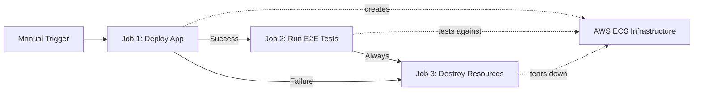
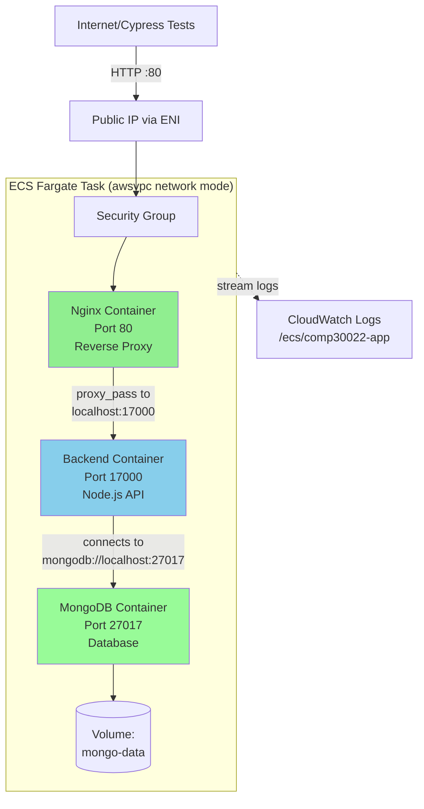
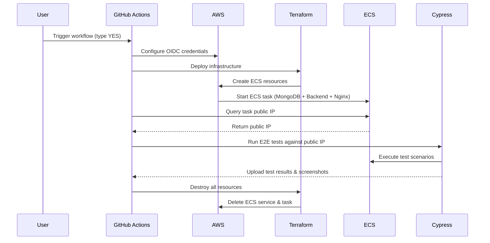
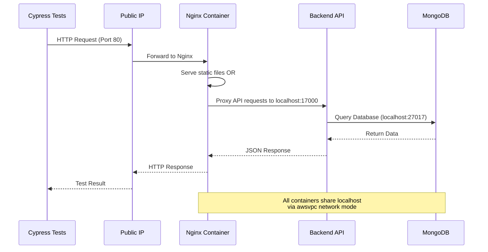
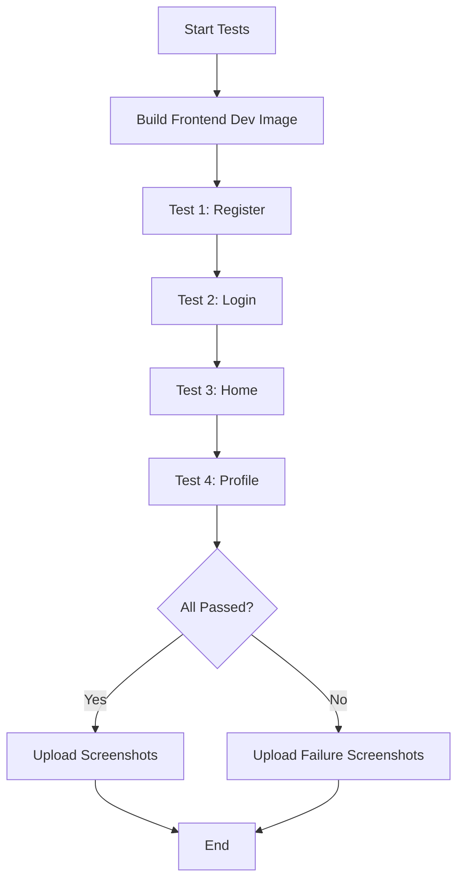
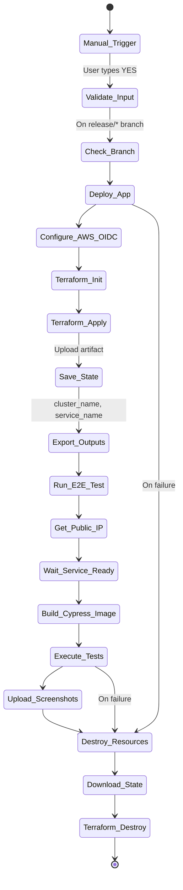

# E2E Testing Environment on AWS ECS

## Overview

This document describes the complete end-to-end (E2E) testing infrastructure deployed on AWS ECS (Elastic Container Service). The testing environment is automatically provisioned, tested, and destroyed using GitHub Actions, Terraform, and Cypress.

## Architecture

### High-Level Workflow



### AWS ECS Task Architecture



## Table of Contents

1. [Workflow Overview](#workflow-overview)
2. [Infrastructure Components](#infrastructure-components)
3. [Deployment Process](#deployment-process)
4. [Testing Process](#testing-process)
5. [Cleanup Process](#cleanup-process)
6. [Configuration](#configuration)
7. [Troubleshooting](#troubleshooting)

---

## Workflow Overview

The E2E testing workflow is triggered manually and consists of three main jobs:



### Workflow Trigger

- **Type**: Manual (`workflow_dispatch`)
- **Requirement**: User must type `YES` to confirm deployment
- **Branch Restriction**: Only runs on `release/*` branches
- **File**: `.github/workflows/run-e2e-test-on-aws-ecs.yml`

---

## Infrastructure Components

### 1. ECS Task Definition

The application runs as a single ECS Fargate task with three containers:

| Container | Image | Port | Purpose |
|-----------|-------|------|---------|
| **MongoDB** | `public.ecr.aws/.../mongodb:latest` | 27017 | Database storage |
| **Backend** | `public.ecr.aws/.../backend:latest` | 17000 | Node.js API server |
| **Nginx** | `public.ecr.aws/.../nginx:latest` | 80 | Reverse proxy & static file serving |

**Network Configuration:**
- All containers share the same network namespace (`awsvpc` mode)
- Communicate via `localhost`
- Only Nginx port (80) is exposed publicly

**Resource Allocation:**
```yaml
CPU: 1024 (1 vCPU)
Memory: 2048 MB (2 GB)
```

### 2. ECS Service

- **Launch Type**: Fargate Spot (cost-optimized)
- **Desired Count**: 1 task
- **Network**: Public subnet with public IP assignment
- **Deployment Strategy**:
  - Minimum healthy: 50%
  - Maximum: 200%

### 3. CloudWatch Logs

All container logs are streamed to CloudWatch:
- **Log Group**: `/ecs/comp30022-app`
- **Stream Prefix**: `ecs`
- Enables debugging and monitoring

### 4. Request Flow Diagram



---

## Deployment Process

### Job 1: `deploy-app`

This job provisions the AWS infrastructure using Terraform.

#### Steps:

1. **Checkout Code**
   ```bash
   uses: actions/checkout@v5
   ```

2. **Configure AWS Credentials**
   - Uses OIDC (OpenID Connect) for secure, keyless authentication
   - Assumes role: `AWS_GITHUB_ACTION_DEPLOY_ROLE_ARN`
   ```yaml
   uses: aws-actions/configure-aws-credentials@v5
   with:
     role-to-assume: ${{ secrets.AWS_GITHUB_ACTION_DEPLOY_ROLE_ARN }}
     aws-region: ${{ secrets.AWS_REGION }}
   ```

3. **Terraform Deployment**
   ```bash
   cd deploy/test/aws
   terraform init      # Initialize Terraform backend
   terraform plan      # Preview changes
   terraform apply -auto-approve  # Apply changes
   ```

4. **Save Terraform State**
   - Uploads `terraform.tfstate` as artifact
   - Required for cleanup job to destroy resources

5. **Export Outputs**
   - `cluster_name`: ECS cluster identifier
   - `service_name`: ECS service name (for IP lookup)

#### Terraform Resources Created:

```hcl
# Main resources defined in deploy/test/aws/main.tf
- aws_cloudwatch_log_group.app
- aws_ecs_task_definition.app
- aws_ecs_service.app
```

#### Configuration Files:

- **`main.tf`**: Resource definitions
- **`variables.tf`**: Input variables
- **`terraform.tfvars`**: Variable values (cluster ARN, subnet IDs, images, etc.)
- **`outputs.tf`**: Output values for downstream jobs

---

## Testing Process

### Job 2: `run-e2e-test`

This job executes Cypress E2E tests against the deployed application.

#### Steps:

1. **Get ECS Task Public IP**
   
   Script: `auto/get-ecs-task-public-ip`
   
   ```bash
   ./auto/get-ecs-task-public-ip <cluster-name> <service-name> <region>
   ```
   
   **How it works:**
   ```mermaid
   sequenceDiagram
       Script->>ECS: List tasks in service
       ECS-->>Script: Task ARN
       Script->>ECS: Describe task
       ECS-->>Script: Network Interface ID (ENI)
       Script->>EC2: Describe network interface
       EC2-->>Script: Public IP address
   ```
   
   - Polls every 10 seconds for up to 10 minutes
   - Retrieves the Elastic Network Interface (ENI) ID from the task
   - Queries EC2 for the public IP associated with the ENI

2. **Set up Docker Buildx**
   ```yaml
   uses: docker/setup-buildx-action@v3
   ```

3. **Install Dependencies**
   ```bash
   ./auto/install-github-action-env
   ```

4. **Test Connectivity**
   ```bash
   sleep 30  # Allow service to fully initialize
   curl -I "http://$PUBLIC_IP"
   ```

5. **Build Frontend Test Image**
   ```bash
   auto/build-frontend-dev
   ```
   
   Creates Docker image `frontend-dev` with Cypress installed.

6. **Run Cypress Tests**
   ```bash
   auto/run-e2e-tests-on-deployed-app "$PUBLIC_IP"
   ```
   
   Executes four test suites sequentially:
   
   | Test Suite | File | Purpose |
   |------------|------|---------|
   | Register | `cypress/e2e/register.cy.js` | User registration flow |
   | Login | `cypress/e2e/login.cy.js` | Authentication |
   | Home | `cypress/e2e/home.cy.js` | Main feed functionality |
   | Profile | `cypress/e2e/profile.cy.js` | User profile management |
   
   **Test Execution:**
   ```bash
   docker run --rm --name cypress-e2e --network=host \
       -v "$(pwd)/cypress/screenshots:/app/cypress/screenshots" \
       -e CYPRESS_BASE_URL=http://$PUBLIC_IP \
       frontend-dev npx cypress run --spec "cypress/e2e/<test>.cy.js"
   ```

7. **Upload Test Artifacts**
   - Screenshots captured on test failures
   - Uploaded to GitHub Actions artifacts

### Test Flow Diagram



---

## Cleanup Process

### Job 3: `post-deploy-destroy-resources`

This job runs **always** (even if tests fail) to ensure resources are cleaned up.

#### Steps:

1. **Download Terraform State**
   ```yaml
   uses: actions/download-artifact@v6
   with:
     name: terraform-app.tfstate
     path: deploy/test/aws
   ```

2. **Terraform Destroy**
   ```bash
   cd deploy/test/aws
   terraform init
   terraform destroy -auto-approve
   ```

#### Resources Destroyed:

- ECS Service (stops all running tasks)
- ECS Task Definition
- CloudWatch Log Group
- Network interfaces automatically released

#### Cost Optimization:

- **Fargate Spot**: ~70% cheaper than on-demand
- **Automatic cleanup**: Prevents orphaned resources
- **Short-lived**: Typical workflow duration: 10-15 minutes

---

## Configuration

### Required GitHub Secrets

| Secret | Description | Example |
|--------|-------------|---------|
| `AWS_GITHUB_ACTION_DEPLOY_ROLE_ARN` | IAM role ARN for OIDC | `arn:aws:iam::123456789012:role/...` |
| `AWS_REGION` | AWS region | `ap-northeast-1` |
| `AWS_ACCESS_KEY_ID` | (Temporary admin access) | `AKIA...` |
| `AWS_SECRET_ACCESS_KEY` | (Temporary admin access) | `wJalrXUt...` |

### Terraform Variables

File: `deploy/test/aws/terraform.tfvars`

```hcl
aws_account_id = "219396432881"

# Pre-built container images in ECR Public
image_nginx   = "public.ecr.aws/g0n3r5g7/comp30022-forum/nginx:latest"
image_backend = "public.ecr.aws/g0n3r5g7/comp30022-forum/backend:latest"
image_mongodb = "public.ecr.aws/g0n3r5g7/comp30022-forum/mongodb:latest"

# Pre-existing infrastructure (manually created)
cluster_arn = "arn:aws:ecs:ap-northeast-1:...:cluster/comp30022-test-cluster"
cluster_id = "comp30022-test-cluster"
subnet_ids = ["subnet-...", "subnet-..."]
security_group_ids = ["sg-..."]
execution_role_arn = "arn:aws:iam::...:role/comp30022-test-ecs-task-execution-role"

# Task configuration
desired_count    = 1
container_cpu    = 1024
container_memory = 2048
```

### Environment Variables

**Backend Container:**
```yaml
NODE_ENV: development
PORT: 17000
MONGODB_URI: mongodb://localhost:27017
MONGODB_NAME: ani
CORS_WHITELIST: "*"  # ⚠️ Insecure - test only
```

**Nginx Container:**
```yaml
BACKEND_HOST: localhost
BACKEND_PORT: 17000
```

---

## Troubleshooting

### Common Issues

#### 1. **Task Fails to Start**

**Symptoms:**
- "Task stopped" errors
- No public IP found

**Solutions:**
```bash
# Check CloudWatch logs
aws logs tail /ecs/comp30022-app --follow

# Check task stopped reason
aws ecs describe-tasks --cluster <cluster> --tasks <task-arn>
```

#### 2. **Public IP Not Found**

**Cause:** Task not in RUNNING state

**Solution:**
- The script waits up to 10 minutes
- Check security group allows egress for image pulls
- Verify subnet has internet gateway attached

#### 3. **Cypress Tests Fail**

**Debug Steps:**
1. Check connectivity: `curl -I http://$PUBLIC_IP`
2. Review uploaded screenshots
3. Check CloudWatch logs for backend errors
4. Verify MongoDB initialized properly

#### 4. **Terraform Destroy Fails**

**Cause:** State file corruption or resource dependencies

**Solution:**
```bash
# Manual cleanup
aws ecs update-service --cluster <cluster> --service <service> --desired-count 0
aws ecs delete-service --cluster <cluster> --service <service>
```

### Monitoring

**CloudWatch Logs:**
```bash
aws logs tail /ecs/comp30022-app --follow --filter-pattern "ERROR"
```

**ECS Task Status:**
```bash
aws ecs describe-tasks \
  --cluster comp30022-test-cluster \
  --tasks $(aws ecs list-tasks --cluster comp30022-test-cluster --query 'taskArns[0]' --output text)
```

---

## Security Considerations

### ✅ Implemented

- **OIDC Authentication**: No long-lived AWS credentials in GitHub
- **IAM Roles**: Least privilege access
- **Fargate**: No EC2 instance management
- **CloudWatch Logs**: Audit trail

### ⚠️ Test-Only Settings

- **CORS**: Wildcard `*` (production should use specific origins)
- **Public IP**: Task directly exposed (production should use ALB)
- **No HTTPS**: HTTP only (production requires SSL/TLS)

---

## Cost Estimation

**Per Test Run (15 minutes):**
- Fargate Spot (1 vCPU, 2GB): ~$0.01
- CloudWatch Logs (minimal): ~$0.001
- Data Transfer: ~$0.001

**Total per run: ~$0.012**

---

## Future Improvements

1. **Infrastructure as Code:**
   - Uncomment and use `deploy-infra` job to create VPC, subnets, and cluster
   - Currently uses pre-existing infrastructure

2. **Blue-Green Deployment:**
   - Run multiple test environments in parallel
   - Zero-downtime updates

3. **Test Parallelization:**
   - Run Cypress specs in parallel
   - Reduce total test time

4. **Artifact Storage:**
   - Store test videos (Cypress recordings)
   - Archive failed test reports

5. **Notifications:**
   - Slack/Email alerts on test failures
   - Integration with monitoring tools

---

## Related Documentation

- [Architecture Overview](./architecture.md)
- [How to Release New Version](./how-to-release-new-version.md)
- [Project README](../README.md)

---

## Workflow Execution Flow



---

## Key Scripts Reference

### `auto/get-ecs-task-public-ip`
Retrieves the public IP address of a running ECS task.

**Usage:**
```bash
./auto/get-ecs-task-public-ip <cluster-name> <service-name> [region]
```

**Algorithm:**
1. Poll ECS for running tasks
2. Extract ENI ID from task attachments
3. Query EC2 for public IP of ENI
4. Retry every 10s for max 10 minutes

### `auto/run-e2e-tests-on-deployed-app`
Executes Cypress E2E tests against a deployed application.

**Usage:**
```bash
auto/run-e2e-tests-on-deployed-app <app-url>
```

**Features:**
- Automatically adds `http://` if missing
- Runs tests in Docker container
- Mounts screenshot volume
- Sets `CYPRESS_BASE_URL` environment variable

### `auto/build-frontend-dev`
Builds the frontend Docker image with Cypress.

**Usage:**
```bash
auto/build-frontend-dev
```

**Output:**
- Image: `frontend-dev`
- Includes: Node.js, frontend code, Cypress

---

## Appendix: Complete Workflow YAML

For the complete workflow configuration, see:
`.github/workflows/run-e2e-test-on-aws-ecs.yml`

Key highlights:
- **Permissions**: `id-token: write` for OIDC
- **Job Dependencies**: `needs: [deploy-app]`
- **Conditional Execution**: `if: always()` for cleanup
- **Artifact Management**: Upload/download Terraform state

---

**Last Updated:** October 29, 2025  
