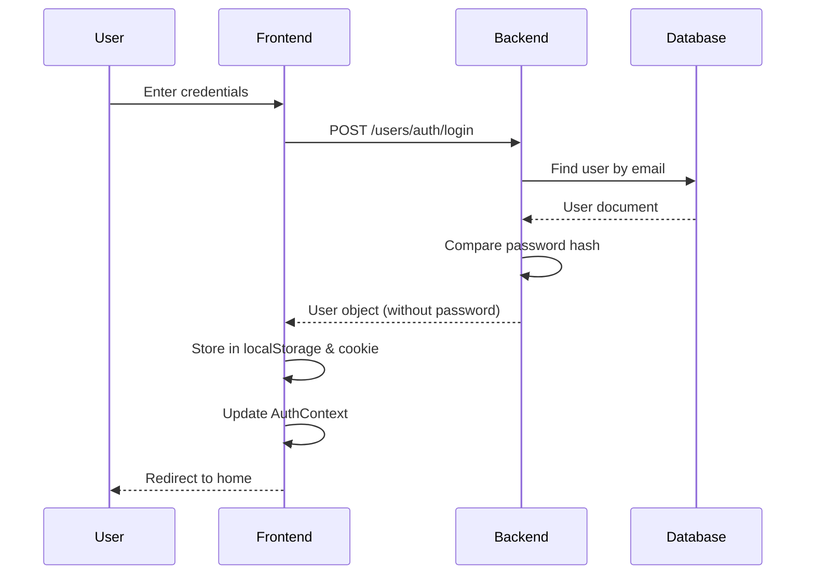

# Identity System Documentation

## Overview

This document provides a comprehensive overview of the identity and authentication system implemented in the COMP30022 IT Project forum application. It covers the current implementation, security considerations, and recommendations for future improvements.

## Current Architecture

### Technology Stack

- **Backend**: Node.js with Express
- **Database**: MongoDB with Mongoose ODM
- **Password Hashing**: bcrypt (salt rounds: 10)
- **Session Management**: Cookie-based with localStorage
- **Frontend State**: React Context API

### Authentication Flow



## Current Implementation

### 1. User Registration

**Location**: `backend/routes/auth.js`

**Process**:
1. Check if username already exists
2. Check if email already exists
3. Generate salt (10 rounds)
4. Hash password using bcrypt
5. Create new user document
6. Save to database
7. Return user object

**Code Example**:
```javascript
// backend/routes/auth.js
router.post('/register', async (req, res) => {
  // Username validation
  const existingUser = await User.findOne({ username: req.body.username });
  if (existingUser) {
    return res.status(400).json({ 
      type: "unameDupErr", 
      message: "Username already taken" 
    });
  }

  // Email validation
  const existingEmail = await User.findOne({ email: req.body.email });
  if (existingEmail) {
    return res.status(400).json({ 
      type: "emailDupErr", 
      message: "Email already taken" 
    });
  }

  // Password hashing
  const salt = await bcrypt.genSalt(10);
  const hashedPwd = await bcrypt.hash(req.body.password, salt);

  // User creation
  const newUser = new User({
    username: req.body.username,
    email: req.body.email,
    password: hashedPwd,
  });

  const user = await newUser.save();
  res.status(200).json(user);
});
```

### 2. User Login

**Location**: `backend/routes/auth.js`

**Process**:
1. Find user by email
2. Verify password using bcrypt.compareSync()
3. Return complete user object if successful
4. Frontend stores user in localStorage and cookies

**Code Example**:
```javascript
router.post('/login', async (req, res) => {
  const user = await User.findOne({ email: req.body.email });
  if (!user) {
    return res.status(404).json("user not exist");
  }

  const validPassword = bcrypt.compareSync(req.body.password, user.password);
  if (!validPassword) {
    return res.status(400).json("wrong password");
  }

  return res.status(200).json(user);
});
```

### 3. Frontend State Management

**Location**: `frontend/src/context/AuthContext.js`

**Components**:
- **AuthContext**: React Context for global authentication state
- **AuthReducer**: Handles state transitions (LOGIN_START, LOGIN_SUCCESS, LOGIN_FAIL, UPDATE_USER, FOLLOW, UNFOLLOW)
- **AuthActions**: Action creators for state management

**Storage**:
- **localStorage**: Persists user object across sessions
- **Cookies**: Stores user credentials for auto-login

### 4. User Model

**Location**: `backend/models/User.js`

**Schema Fields**:
```javascript
{
  username: String (unique, 2-20 chars),
  email: String (unique, max 50 chars),
  password: String (hashed, 8-15 chars before hashing),
  profilePicture: Buffer (binary image data),
  followers: Array (user IDs),
  followings: Array (user IDs),
  isAdmin: Boolean (default: false),
  desc: String (max 50 chars),
  age: Number (0-200),
  from: String (max 20 chars),
  timestamps: true (createdAt, updatedAt)
}
```

## Security Analysis

### Current Security Measures ✅

1. **Password Hashing**: Uses bcrypt with salt rounds (10)
2. **CORS Protection**: Configurable whitelist for allowed origins
3. **Helmet.js**: HTTP security headers
4. **Input Validation**: Username and email uniqueness checks
5. **HTTPS Ready**: Docker setup supports SSL/TLS configuration

### Security Concerns ⚠️

1. **No JWT/Token-Based Authentication**
   - Current system returns full user object including password hash
   - No session expiration mechanism
   - Vulnerable to XSS attacks (localStorage exposure)

2. **Password Returned in Response**
   - Login endpoint returns complete user object including hashed password
   - Should exclude password field from response

3. **Credentials Stored in Cookies**
   - Plain text password stored in cookies for auto-login
   - Serious security vulnerability

4. **No Session Management**
   - No logout mechanism on backend
   - No session expiration
   - No refresh token mechanism

5. **No Rate Limiting**
   - Vulnerable to brute force attacks
   - No account lockout mechanism

6. **No Email Verification**
   - Users can register without email confirmation
   - Potential for spam accounts

7. **Password Constraints**
   - Max length of 15 characters is limiting
   - No complexity requirements enforced on backend

## Recommendations for Improvement

### 1. Implement JWT (JSON Web Tokens)

**Benefits**:
- Stateless authentication
- Token expiration
- Secure transmission
- Industry standard

**Implementation Example**:
```javascript
// Install jsonwebtoken
// npm install jsonwebtoken

const jwt = require('jsonwebtoken');

// Login endpoint
router.post('/login', async (req, res) => {
  const user = await User.findOne({ email: req.body.email });
  if (!user) {
    return res.status(404).json("user not exist");
  }

  const validPassword = await bcrypt.compare(req.body.password, user.password);
  if (!validPassword) {
    return res.status(400).json("wrong password");
  }

  // Generate JWT
  const token = jwt.sign(
    { userId: user._id, email: user.email },
    process.env.JWT_SECRET,
    { expiresIn: '24h' }
  );

  // Return user without password
  const { password, ...userWithoutPassword } = user._doc;
  
  res.status(200).json({
    user: userWithoutPassword,
    token: token
  });
});

// Middleware for protected routes
const authenticateToken = (req, res, next) => {
  const token = req.headers['authorization']?.split(' ')[1];
  
  if (!token) {
    return res.status(401).json("Access denied");
  }

  jwt.verify(token, process.env.JWT_SECRET, (err, user) => {
    if (err) {
      return res.status(403).json("Invalid token");
    }
    req.user = user;
    next();
  });
};

// Usage
router.get('/profile', authenticateToken, async (req, res) => {
  // req.user contains the decoded JWT payload
  const user = await User.findById(req.user.userId);
  res.json(user);
});
```

### 2. Implement Refresh Tokens

**Purpose**: Allow long-lived sessions while maintaining security

```javascript
// Generate both access and refresh tokens
const generateTokens = (userId) => {
  const accessToken = jwt.sign(
    { userId },
    process.env.JWT_SECRET,
    { expiresIn: '15m' }
  );

  const refreshToken = jwt.sign(
    { userId },
    process.env.REFRESH_TOKEN_SECRET,
    { expiresIn: '7d' }
  );

  return { accessToken, refreshToken };
};

// Refresh endpoint
router.post('/refresh', async (req, res) => {
  const { refreshToken } = req.body;
  
  if (!refreshToken) {
    return res.status(401).json("Refresh token required");
  }

  try {
    const decoded = jwt.verify(refreshToken, process.env.REFRESH_TOKEN_SECRET);
    const tokens = generateTokens(decoded.userId);
    res.json(tokens);
  } catch (err) {
    res.status(403).json("Invalid refresh token");
  }
});
```

### 3. Implement Rate Limiting

**Purpose**: Prevent brute force attacks

```javascript
// Install express-rate-limit
// npm install express-rate-limit

const rateLimit = require('express-rate-limit');

const loginLimiter = rateLimit({
  windowMs: 15 * 60 * 1000, // 15 minutes
  max: 5, // 5 attempts
  message: "Too many login attempts, please try again later"
});

router.post('/login', loginLimiter, async (req, res) => {
  // Login logic
});
```

### 4. Add Email Verification

**Implementation Steps**:
1. Add `emailVerified` boolean field to User model
2. Generate verification token on registration
3. Send verification email with token
4. Create verification endpoint
5. Only allow login for verified users

```javascript
// Add to User model
emailVerified: {
  type: Boolean,
  default: false
},
verificationToken: String,
verificationTokenExpiry: Date

// Registration
const verificationToken = crypto.randomBytes(32).toString('hex');
newUser.verificationToken = verificationToken;
newUser.verificationTokenExpiry = Date.now() + 24 * 60 * 60 * 1000; // 24 hours

// Send email with verification link
// /verify?token=verificationToken

// Verification endpoint
router.get('/verify', async (req, res) => {
  const user = await User.findOne({
    verificationToken: req.query.token,
    verificationTokenExpiry: { $gt: Date.now() }
  });

  if (!user) {
    return res.status(400).json("Invalid or expired token");
  }

  user.emailVerified = true;
  user.verificationToken = undefined;
  user.verificationTokenExpiry = undefined;
  await user.save();

  res.json("Email verified successfully");
});
```

### 5. Implement Password Reset Flow

```javascript
// Request password reset
router.post('/forgot-password', async (req, res) => {
  const user = await User.findOne({ email: req.body.email });
  if (!user) {
    // Don't reveal if user exists
    return res.json("If email exists, reset link sent");
  }

  const resetToken = crypto.randomBytes(32).toString('hex');
  user.resetPasswordToken = resetToken;
  user.resetPasswordExpiry = Date.now() + 60 * 60 * 1000; // 1 hour
  await user.save();

  // Send email with reset link
  res.json("Reset link sent");
});

// Reset password
router.post('/reset-password', async (req, res) => {
  const user = await User.findOne({
    resetPasswordToken: req.body.token,
    resetPasswordExpiry: { $gt: Date.now() }
  });

  if (!user) {
    return res.status(400).json("Invalid or expired token");
  }

  const salt = await bcrypt.genSalt(10);
  user.password = await bcrypt.hash(req.body.newPassword, salt);
  user.resetPasswordToken = undefined;
  user.resetPasswordExpiry = undefined;
  await user.save();

  res.json("Password reset successfully");
});
```

### 6. Secure Password Storage in Frontend

**Current Issue**: Passwords stored in cookies

**Solution**: Only store JWT tokens
```javascript
// frontend/src/pages/login/Login.jsx
const loginSetCookie = async (e) => {
  e.preventDefault();
  
  const response = await axios.post('/users/auth/login', {
    email: email.current.value,
    password: password.current.value
  });

  const { token, user } = response.data;
  
  // Store only token in cookies (httpOnly would be better)
  setCookie("token", token, {
    path: '/',
    maxAge: 24 * 60 * 60, // 24 hours
    sameSite: 'strict'
  });

  // Update context with user data
  dispatch(loginSuccess(user));
};
```

### 7. Add Logout Functionality

```javascript
// Backend: Token blacklist (optional with JWT)
// For stateless JWT, logout is frontend-only
// For enhanced security, implement token blacklist

// Frontend
const logout = () => {
  // Clear localStorage
  localStorage.removeItem('user');
  
  // Clear cookies
  removeCookie('token');
  
  // Reset auth context
  dispatch({ type: 'LOGOUT' });
  
  // Redirect to login
  navigate('/login');
};
```

### 8. Implement RBAC (Role-Based Access Control)

**Current**: Basic `isAdmin` boolean

**Enhanced**:
```javascript
// User model
roles: {
  type: [String],
  enum: ['user', 'moderator', 'admin'],
  default: ['user']
},
permissions: {
  type: [String],
  enum: ['read', 'write', 'delete', 'moderate', 'admin'],
  default: ['read', 'write']
}

// Middleware
const checkPermission = (requiredPermission) => {
  return (req, res, next) => {
    if (!req.user.permissions.includes(requiredPermission)) {
      return res.status(403).json("Insufficient permissions");
    }
    next();
  };
};

// Usage
router.delete('/post/:id', authenticateToken, checkPermission('delete'), async (req, res) => {
  // Delete post logic
});
```

### 9. Add Two-Factor Authentication (2FA)

```javascript
// Install speakeasy for TOTP
// npm install speakeasy qrcode

const speakeasy = require('speakeasy');
const QRCode = require('qrcode');

// Enable 2FA
router.post('/enable-2fa', authenticateToken, async (req, res) => {
  const secret = speakeasy.generateSecret({
    name: `Forum (${req.user.email})`
  });

  // Generate QR code
  const qrCode = await QRCode.toDataURL(secret.otpauth_url);

  // Store secret in user document (encrypted)
  await User.findByIdAndUpdate(req.user.userId, {
    twoFactorSecret: secret.base32,
    twoFactorEnabled: false // Enable after verification
  });

  res.json({ qrCode, secret: secret.base32 });
});

// Verify 2FA setup
router.post('/verify-2fa', authenticateToken, async (req, res) => {
  const user = await User.findById(req.user.userId);
  
  const verified = speakeasy.totp.verify({
    secret: user.twoFactorSecret,
    encoding: 'base32',
    token: req.body.token
  });

  if (verified) {
    user.twoFactorEnabled = true;
    await user.save();
    res.json("2FA enabled successfully");
  } else {
    res.status(400).json("Invalid code");
  }
});

// Login with 2FA
router.post('/login', async (req, res) => {
  // ... existing password verification ...

  if (user.twoFactorEnabled) {
    if (!req.body.twoFactorCode) {
      return res.status(200).json({ requires2FA: true });
    }

    const verified = speakeasy.totp.verify({
      secret: user.twoFactorSecret,
      encoding: 'base32',
      token: req.body.twoFactorCode
    });

    if (!verified) {
      return res.status(400).json("Invalid 2FA code");
    }
  }

  // Generate and return tokens
});
```

## Migration Path

### Phase 1: Critical Security Fixes (Week 1)
1. Remove password from login response
2. Remove plain text password from cookies
3. Implement basic JWT authentication
4. Add token to all API requests

### Phase 2: Enhanced Security (Week 2)
1. Implement refresh tokens
2. Add rate limiting
3. Implement logout functionality
4. Add password reset flow

### Phase 3: Advanced Features (Week 3-4)
1. Email verification
2. Enhanced RBAC
3. Two-factor authentication (optional)
4. Session management dashboard

## Environment Variables

Add to `.env`:
```env
JWT_SECRET=your-super-secret-jwt-key-min-32-chars
REFRESH_TOKEN_SECRET=your-super-secret-refresh-key-min-32-chars
JWT_EXPIRY=15m
REFRESH_TOKEN_EXPIRY=7d
SMTP_HOST=smtp.gmail.com
SMTP_PORT=587
SMTP_USER=your-email@gmail.com
SMTP_PASS=your-app-password
```

## Testing Recommendations

### Unit Tests
```javascript
// Example: auth.test.js
describe('Authentication', () => {
  it('should hash password on registration', async () => {
    const response = await request(app)
      .post('/users/auth/register')
      .send({
        username: 'testuser',
        email: 'test@example.com',
        password: 'testpassword123'
      });
    
    expect(response.status).toBe(200);
    expect(response.body.password).not.toBe('testpassword123');
  });

  it('should return JWT on successful login', async () => {
    const response = await request(app)
      .post('/users/auth/login')
      .send({
        email: 'test@example.com',
        password: 'testpassword123'
      });
    
    expect(response.status).toBe(200);
    expect(response.body.token).toBeDefined();
  });

  it('should reject invalid JWT', async () => {
    const response = await request(app)
      .get('/users/profile')
      .set('Authorization', 'Bearer invalid-token');
    
    expect(response.status).toBe(403);
  });
});
```

### Integration Tests
```javascript
describe('Authentication Flow', () => {
  it('should complete full registration and login flow', async () => {
    // Register
    const registerResponse = await request(app)
      .post('/users/auth/register')
      .send({
        username: 'newuser',
        email: 'newuser@example.com',
        password: 'password123'
      });
    expect(registerResponse.status).toBe(200);

    // Login
    const loginResponse = await request(app)
      .post('/users/auth/login')
      .send({
        email: 'newuser@example.com',
        password: 'password123'
      });
    expect(loginResponse.status).toBe(200);
    const { token } = loginResponse.body;

    // Access protected route
    const profileResponse = await request(app)
      .get('/users/profile')
      .set('Authorization', `Bearer ${token}`);
    expect(profileResponse.status).toBe(200);
  });
});
```

## Conclusion

The current identity system provides basic authentication functionality but lacks critical security features required for production use. The recommendations above provide a roadmap for implementing industry-standard authentication and authorization mechanisms.

### Key Takeaways:
- ✅ Current system has password hashing and basic authentication
- ⚠️ Critical security vulnerabilities need immediate attention
- 🔄 JWT-based authentication should be implemented
- 📈 Follow phased migration approach
- 🔒 Security should be prioritized over convenience

### Next Steps:
1. Review and approve this documentation
2. Prioritize security improvements
3. Create implementation tickets for each phase
4. Begin with Phase 1 (Critical Security Fixes)
5. Implement comprehensive testing suite

For questions or clarifications, please refer to the following resources:
- [OWASP Authentication Cheat Sheet](https://cheatsheetseries.owasp.org/cheatsheets/Authentication_Cheat_Sheet.html)
- [JWT Best Practices](https://tools.ietf.org/html/rfc8725)
- [Node.js Security Best Practices](https://nodejs.org/en/docs/guides/security/)
