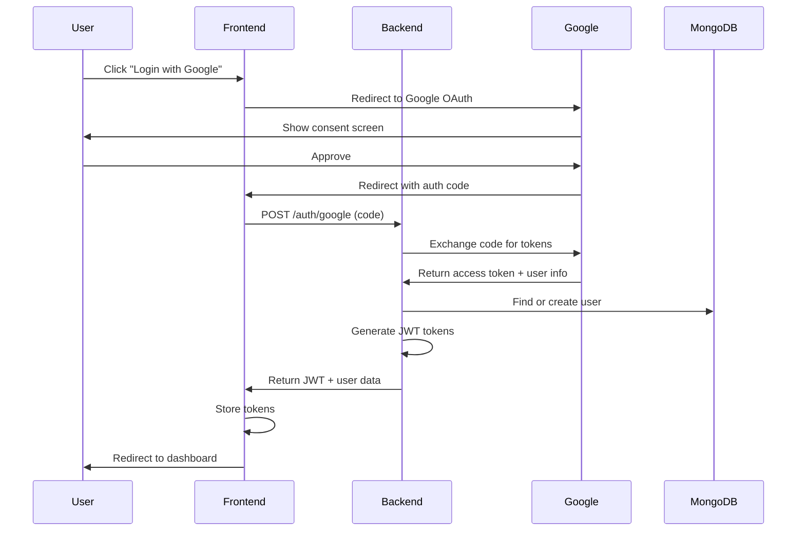

# OAuth2 & Google Login Implementation Guide

## Overview

This guide provides a detailed implementation plan for integrating third-party authentication (OAuth2) with Google Login into the forum application. This extends the JWT-based authentication system with social login capabilities.

## Platform Compatibility

### ✅ Supported Platforms

The OAuth2 + JWT approach works seamlessly across:

**Web Platforms:**
- ✅ Desktop browsers (Chrome, Firefox, Safari, Edge)
- ✅ Mobile browsers (iOS Safari, Chrome Mobile, Samsung Internet)
- ✅ Progressive Web Apps (PWAs)
- ✅ Single Page Applications (SPAs)

**Mobile Native Apps:**
- ✅ iOS apps (React Native, Flutter, Swift)
- ✅ Android apps (React Native, Flutter, Kotlin/Java)
- ✅ Hybrid apps (Ionic, Cordova)

**Why It Works:**
- **JWT tokens**: Standard, platform-agnostic format
- **HTTP/HTTPS**: Universal protocol support
- **OAuth2**: Industry standard supported by all platforms
- **JSON**: Universal data format

### Platform-Specific Considerations

| Platform | Token Storage | Redirect Handling | Notes |
|----------|--------------|-------------------|-------|
| **Web** | localStorage/sessionStorage | Standard redirect | Full support |
| **iOS Native** | Keychain | Custom URL schemes | Use ASWebAuthenticationSession |
| **Android Native** | SharedPreferences (encrypted) | Custom URL schemes | Use Chrome Custom Tabs |
| **React Native** | AsyncStorage/SecureStore | Deep linking | Use expo-auth-session or react-native-app-auth |
| **Flutter** | secure_storage | Deep linking | Use flutter_appauth |
| **PWA** | localStorage + Service Worker | Standard redirect | Works like web |

## Architecture Overview



## Implementation Steps

### Phase 1: Google Cloud Setup (30 minutes)

#### 1.1 Create Google Cloud Project

1. Go to [Google Cloud Console](https://console.cloud.google.com/)
2. Create a new project: "Forum App" or use existing
3. Enable Google+ API (for user profile access)

#### 1.2 Configure OAuth Consent Screen

1. Navigate to "APIs & Services" → "OAuth consent screen"
2. Choose "External" user type
3. Fill in application details:
   ```
   App name: Forum Application
   User support email: your-email@example.com
   Developer contact: your-email@example.com
   ```
4. Add scopes:
   - `.../auth/userinfo.email`
   - `.../auth/userinfo.profile`
5. Add test users (for development)

#### 1.3 Create OAuth Credentials

1. Navigate to "Credentials" → "Create Credentials" → "OAuth 2.0 Client ID"
2. Choose application type:

**For Web Application:**
```
Application type: Web application
Name: Forum Web Client

Authorized JavaScript origins:
- http://localhost:3000
- https://your-production-domain.com

Authorized redirect URIs:
- http://localhost:3000/auth/google/callback
- https://your-production-domain.com/auth/google/callback
```

**For Mobile (React Native/Flutter):**
```
Application type: iOS / Android
Name: Forum Mobile Client

Bundle ID (iOS): com.yourcompany.forum
Package name (Android): com.yourcompany.forum
```

3. Save Client ID and Client Secret

### Phase 2: Backend Implementation (4-6 hours)

#### 2.1 Install Dependencies

```bash
cd backend
npm install passport passport-google-oauth20
```

#### 2.2 Update Environment Variables

Add to `backend/config.env`:
```env
# Google OAuth Configuration
GOOGLE_CLIENT_ID=your-client-id.apps.googleusercontent.com
GOOGLE_CLIENT_SECRET=your-client-secret
GOOGLE_CALLBACK_URL=http://localhost:17000/auth/google/callback

# Frontend URL for redirects
FRONTEND_URL=http://localhost:3000

# JWT Configuration (from previous guide)
JWT_SECRET=your-jwt-secret
REFRESH_TOKEN_SECRET=your-refresh-token-secret
JWT_EXPIRY=15m
REFRESH_TOKEN_EXPIRY=7d
```

#### 2.3 Create Google OAuth Strategy

Create `backend/config/passport.js`:
```javascript
const passport = require('passport');
const GoogleStrategy = require('passport-google-oauth20').Strategy;
const User = require('../models/User');

passport.use(
  new GoogleStrategy(
    {
      clientID: process.env.GOOGLE_CLIENT_ID,
      clientSecret: process.env.GOOGLE_CLIENT_SECRET,
      callbackURL: process.env.GOOGLE_CALLBACK_URL,
      scope: ['profile', 'email']
    },
    async (accessToken, refreshToken, profile, done) => {
      try {
        // Check if user exists
        let user = await User.findOne({ googleId: profile.id });

        if (user) {
          // Update user info
          user.email = profile.emails[0].value;
          user.username = user.username || profile.displayName || profile.emails[0].value.split('@')[0];
          user.profilePicture = user.profilePicture || profile.photos[0]?.value;
          await user.save();
          return done(null, user);
        }

        // Check if email exists (link accounts)
        const existingEmailUser = await User.findOne({ 
          email: profile.emails[0].value 
        });

        if (existingEmailUser) {
          // Link Google account to existing user
          existingEmailUser.googleId = profile.id;
          existingEmailUser.profilePicture = existingEmailUser.profilePicture || profile.photos[0]?.value;
          await existingEmailUser.save();
          return done(null, existingEmailUser);
        }

        // Create new user
        const newUser = new User({
          googleId: profile.id,
          email: profile.emails[0].value,
          username: profile.displayName || profile.emails[0].value.split('@')[0],
          emailVerified: true, // Google emails are verified
          profilePicture: profile.photos[0]?.value,
          // No password needed for OAuth users
          password: null
        });

        await newUser.save();
        done(null, newUser);
      } catch (err) {
        console.error('Google OAuth error:', err);
        done(err, null);
      }
    }
  )
);

// Serialize user for session (not used with JWT, but required by passport)
passport.serializeUser((user, done) => {
  done(null, user.id);
});

passport.deserializeUser(async (id, done) => {
  try {
    const user = await User.findById(id);
    done(null, user);
  } catch (err) {
    done(err, null);
  }
});

module.exports = passport;
```

#### 2.4 Update User Model

Update `backend/models/User.js` to support OAuth:
```javascript
const UserSchema = new mongoose.Schema({
  username: {
    type: String,
    required: true,
    min: 2,
    max: 20,
    unique: true
  },
  email: {
    type: String,
    required: true,
    max: 50,
    unique: true,
  },
  password: {
    type: String,
    required: false, // Not required for OAuth users
    min: 8,
    max: 100,
  },
  // OAuth fields
  googleId: {
    type: String,
    unique: true,
    sparse: true // Allow null values
  },
  githubId: {
    type: String,
    unique: true,
    sparse: true
  },
  oauthProvider: {
    type: String,
    enum: ['local', 'google', 'github', 'facebook'],
    default: 'local'
  },
  // ... rest of schema
});

// Update toJSON to exclude OAuth IDs
UserSchema.methods.toJSON = function() {
  const obj = this.toObject();
  delete obj.password;
  delete obj.googleId;
  delete obj.githubId;
  delete obj.verificationToken;
  delete obj.resetPasswordToken;
  delete obj.refreshTokens;
  delete obj.twoFactorSecret;
  return obj;
};
```

#### 2.5 Create OAuth Routes

Create or update `backend/routes/auth.js`:
```javascript
const router = require('express').Router();
const passport = require('../config/passport');
const { generateAccessToken, generateRefreshToken } = require('../utils/jwtUtils');

// Initialize passport
router.use(passport.initialize());

// Google OAuth routes
router.get('/google',
  passport.authenticate('google', { 
    scope: ['profile', 'email'],
    session: false 
  })
);

// Google OAuth callback
router.get('/google/callback',
  passport.authenticate('google', { 
    session: false,
    failureRedirect: `${process.env.FRONTEND_URL}/login?error=oauth_failed`
  }),
  async (req, res) => {
    try {
      const user = req.user;

      // Generate JWT tokens
      const accessToken = generateAccessToken(user._id, user.email);
      const refreshToken = generateRefreshToken(user._id);

      // Store refresh token
      if (!user.refreshTokens) {
        user.refreshTokens = [];
      }
      user.refreshTokens.push(refreshToken);
      
      // Keep only last 5 refresh tokens
      if (user.refreshTokens.length > 5) {
        user.refreshTokens = user.refreshTokens.slice(-5);
      }
      
      await user.save();

      // Redirect to frontend with tokens
      // Use URL parameters (for web) or deep link (for mobile)
      const redirectUrl = `${process.env.FRONTEND_URL}/auth/callback?` +
        `token=${accessToken}&` +
        `refresh=${refreshToken}&` +
        `user=${encodeURIComponent(JSON.stringify(user.toJSON()))}`;

      res.redirect(redirectUrl);
    } catch (err) {
      console.error('OAuth callback error:', err);
      res.redirect(`${process.env.FRONTEND_URL}/login?error=server_error`);
    }
  }
);

// Mobile OAuth endpoint (returns JSON instead of redirect)
router.post('/google/mobile', async (req, res) => {
  try {
    const { idToken } = req.body;
    
    // Verify Google ID token
    const { OAuth2Client } = require('google-auth-library');
    const client = new OAuth2Client(process.env.GOOGLE_CLIENT_ID);
    
    const ticket = await client.verifyIdToken({
      idToken: idToken,
      audience: process.env.GOOGLE_CLIENT_ID,
    });
    
    const payload = ticket.getPayload();
    const googleId = payload['sub'];
    const email = payload['email'];
    const name = payload['name'];
    const picture = payload['picture'];

    // Find or create user
    let user = await User.findOne({ googleId });

    if (!user) {
      const existingEmailUser = await User.findOne({ email });
      
      if (existingEmailUser) {
        existingEmailUser.googleId = googleId;
        existingEmailUser.profilePicture = existingEmailUser.profilePicture || picture;
        await existingEmailUser.save();
        user = existingEmailUser;
      } else {
        user = new User({
          googleId,
          email,
          username: name || email.split('@')[0],
          emailVerified: true,
          profilePicture: picture,
          oauthProvider: 'google'
        });
        await user.save();
      }
    }

    // Generate JWT tokens
    const accessToken = generateAccessToken(user._id, user.email);
    const refreshToken = generateRefreshToken(user._id);

    user.refreshTokens = user.refreshTokens || [];
    user.refreshTokens.push(refreshToken);
    if (user.refreshTokens.length > 5) {
      user.refreshTokens = user.refreshTokens.slice(-5);
    }
    await user.save();

    res.json({
      message: "Login successful",
      user: user.toJSON(),
      accessToken,
      refreshToken
    });
  } catch (err) {
    console.error('Mobile OAuth error:', err);
    res.status(400).json({ message: "Invalid Google token" });
  }
});

module.exports = router;
```

#### 2.6 Update Server Configuration

Update `backend/server.js`:
```javascript
const passport = require('./config/passport'); // Add this

// After middleware setup
app.use(passport.initialize());

// Mount auth routes
app.use("/auth", authRouter); // Changed from "/users/auth"
```

### Phase 3: Frontend Web Implementation (3-4 hours)

#### 3.1 Install Dependencies

```bash
cd frontend
npm install @react-oauth/google jwt-decode
```

#### 3.2 Setup Google OAuth Provider

Update `frontend/src/index.js` or `App.js`:
```javascript
import { GoogleOAuthProvider } from '@react-oauth/google';

const root = ReactDOM.createRoot(document.getElementById('root'));
root.render(
  <React.StrictMode>
    <GoogleOAuthProvider clientId={process.env.REACT_APP_GOOGLE_CLIENT_ID}>
      <App />
    </GoogleOAuthProvider>
  </React.StrictMode>
);
```

#### 3.3 Create OAuth Callback Handler

Create `frontend/src/pages/auth/GoogleCallback.jsx`:
```javascript
import { useEffect, useContext } from 'react';
import { useNavigate, useSearchParams } from 'react-router-dom';
import { AuthContext } from '../../context/AuthContext';
import { CircularProgress } from '@mui/material';

export default function GoogleCallback() {
  const [searchParams] = useSearchParams();
  const navigate = useNavigate();
  const { dispatch } = useContext(AuthContext);

  useEffect(() => {
    const token = searchParams.get('token');
    const refresh = searchParams.get('refresh');
    const userStr = searchParams.get('user');
    const error = searchParams.get('error');

    if (error) {
      console.error('OAuth error:', error);
      navigate('/login?error=' + error);
      return;
    }

    if (token && refresh && userStr) {
      try {
        const user = JSON.parse(decodeURIComponent(userStr));

        // Store tokens
        localStorage.setItem('accessToken', token);
        localStorage.setItem('refreshToken', refresh);
        localStorage.setItem('user', JSON.stringify(user));

        // Update context
        dispatch({ type: 'LOGIN_SUCCESS', payload: user });

        // Redirect to home
        navigate('/');
      } catch (err) {
        console.error('Callback error:', err);
        navigate('/login?error=callback_failed');
      }
    } else {
      navigate('/login?error=missing_params');
    }
  }, [searchParams, dispatch, navigate]);

  return (
    <div style={{ 
      display: 'flex', 
      justifyContent: 'center', 
      alignItems: 'center', 
      height: '100vh' 
    }}>
      <CircularProgress />
      <p style={{ marginLeft: '20px' }}>Logging in with Google...</p>
    </div>
  );
}
```

#### 3.4 Update Login Component

Update `frontend/src/pages/login/Login.jsx`:
```javascript
import { GoogleLogin } from '@react-oauth/google';
import axios from 'axios';

export default function Login() {
  // ... existing code ...

  const handleGoogleSuccess = async (credentialResponse) => {
    try {
      setIsFetching(true);

      // For web, use popup/redirect flow
      // Redirect to backend OAuth endpoint
      window.location.href = `${process.env.REACT_APP_BACKEND_URL}/auth/google`;
    } catch (err) {
      console.error('Google login error:', err);
      setError('Google login failed. Please try again.');
      setIsFetching(false);
    }
  };

  const handleGoogleError = () => {
    setError('Google login failed. Please try again.');
  };

  return (
    <div className="login">
      <div className="loginWrapper">
        <div className="loginLeft">
          <h3 className="loginLogo">Ani Ani Login</h3>
          <span className="loginDesc">
            Connect with another Ani friends here ^&^
          </span>
        </div>
        <div className="loginRight">
          <form className="loginBox" onSubmit={handleLogin}>
            {/* Existing email/password inputs */}
            
            {error && <div className="loginError">{error}</div>}
            
            <button 
              className="loginButton" 
              type='submit' 
              disabled={isFetching}
            >
              {isFetching ? <CircularProgress size='20px' /> : "Log In"}
            </button>

            {/* Divider */}
            <div style={{ 
              margin: '20px 0', 
              textAlign: 'center',
              borderTop: '1px solid #ddd',
              paddingTop: '20px'
            }}>
              <span style={{ color: '#666' }}>OR</span>
            </div>

            {/* Google Login Button */}
            <div style={{ 
              display: 'flex', 
              justifyContent: 'center',
              marginBottom: '20px'
            }}>
              <GoogleLogin
                onSuccess={handleGoogleSuccess}
                onError={handleGoogleError}
                useOneTap
                text="continue_with"
                shape="rectangular"
                size="large"
                width="300"
              />
            </div>

            <span className="loginForgot">Forgot Password?</span>
            <button 
              className="loginRegisterButton" 
              onClick={redirectToRegister}
              type="button"
            >
              Register
            </button>
          </form>
        </div>
      </div>
    </div>
  );
}
```

#### 3.5 Add Route for Callback

Update `frontend/src/App.js`:
```javascript
import GoogleCallback from './pages/auth/GoogleCallback';

function App() {
  return (
    <BrowserRouter>
      <Routes>
        {/* Existing routes */}
        <Route path="/login" element={<Login />} />
        <Route path="/auth/callback" element={<GoogleCallback />} />
        {/* ... */}
      </Routes>
    </BrowserRouter>
  );
}
```

#### 3.6 Update Environment Variables

Create or update `frontend/.env`:
```env
REACT_APP_GOOGLE_CLIENT_ID=your-client-id.apps.googleusercontent.com
REACT_APP_BACKEND_URL=http://localhost:17000
```

### Phase 4: Mobile Implementation (React Native Example)

#### 4.1 Install Dependencies

```bash
npm install @react-native-google-signin/google-signin
# OR for Expo
expo install expo-auth-session expo-random
```

#### 4.2 Configure Google Sign-In (React Native)

```javascript
import {
  GoogleSignin,
  statusCodes,
} from '@react-native-google-signin/google-signin';
import axios from 'axios';

// Configure Google Sign-In
GoogleSignin.configure({
  webClientId: 'your-web-client-id.apps.googleusercontent.com', // From Google Cloud Console
  iosClientId: 'your-ios-client-id.apps.googleusercontent.com',
  offlineAccess: true,
});

// Login component
const LoginScreen = () => {
  const [loading, setLoading] = useState(false);

  const handleGoogleLogin = async () => {
    try {
      setLoading(true);
      
      // Check if device supports Google Play Services
      await GoogleSignin.hasPlayServices();
      
      // Get user info and ID token
      const userInfo = await GoogleSignin.signIn();
      const tokens = await GoogleSignin.getTokens();

      // Send ID token to backend
      const response = await axios.post(
        `${API_URL}/auth/google/mobile`,
        { idToken: tokens.idToken }
      );

      const { accessToken, refreshToken, user } = response.data;

      // Store tokens securely
      await SecureStore.setItemAsync('accessToken', accessToken);
      await SecureStore.setItemAsync('refreshToken', refreshToken);
      await AsyncStorage.setItem('user', JSON.stringify(user));

      // Update app state
      dispatch({ type: 'LOGIN_SUCCESS', payload: user });

    } catch (error) {
      if (error.code === statusCodes.SIGN_IN_CANCELLED) {
        console.log('User cancelled sign in');
      } else if (error.code === statusCodes.IN_PROGRESS) {
        console.log('Sign in is in progress');
      } else if (error.code === statusCodes.PLAY_SERVICES_NOT_AVAILABLE) {
        console.log('Play services not available');
      } else {
        console.error('Google sign in error:', error);
      }
    } finally {
      setLoading(false);
    }
  };

  return (
    <View style={styles.container}>
      <TextInput placeholder="Email" />
      <TextInput placeholder="Password" secureTextEntry />
      <Button title="Login" onPress={handleEmailLogin} />
      
      <Text style={styles.divider}>OR</Text>
      
      <TouchableOpacity 
        style={styles.googleButton}
        onPress={handleGoogleLogin}
        disabled={loading}
      >
        <Image 
          source={require('./assets/google-logo.png')} 
          style={styles.googleLogo} 
        />
        <Text style={styles.googleButtonText}>
          {loading ? 'Signing in...' : 'Continue with Google'}
        </Text>
      </TouchableOpacity>
    </View>
  );
};
```

### Phase 5: Testing (2-3 hours)

#### 5.1 Web Testing

```bash
# Test Google OAuth flow
1. Start backend: cd backend && npm start
2. Start frontend: cd frontend && npm start
3. Navigate to http://localhost:3000/login
4. Click "Continue with Google"
5. Verify redirect to Google
6. Approve permissions
7. Verify redirect back with tokens
8. Verify user is logged in
9. Check localStorage for tokens
10. Test protected routes
```

#### 5.2 API Testing

```bash
# Test mobile endpoint
curl -X POST http://localhost:17000/auth/google/mobile \
  -H "Content-Type: application/json" \
  -d '{
    "idToken": "google-id-token-from-mobile-sdk"
  }'

# Expected response:
{
  "message": "Login successful",
  "user": { /* user object */ },
  "accessToken": "jwt-access-token",
  "refreshToken": "jwt-refresh-token"
}
```

#### 5.3 Security Testing

```bash
# Test invalid token
curl -X POST http://localhost:17000/auth/google/mobile \
  -H "Content-Type: application/json" \
  -d '{"idToken": "invalid-token"}'
# Should return 400 error

# Test token expiration
# Wait for JWT to expire (15 minutes)
# Try accessing protected route
# Should return 401 error
# Frontend should auto-refresh token
```

## Security Considerations

### 1. Token Security

**✅ Best Practices:**
- Store access tokens in memory or secure storage
- Store refresh tokens in HttpOnly cookies (web) or Keychain/Keystore (mobile)
- Never log or expose tokens
- Implement token rotation
- Set appropriate expiration times

**⚠️ Avoid:**
- Storing tokens in localStorage (vulnerable to XSS on web)
- Sending tokens in URL parameters
- Using same token for multiple sessions

### 2. OAuth State Parameter

Add CSRF protection:
```javascript
// Backend
router.get('/google', (req, res, next) => {
  const state = crypto.randomBytes(32).toString('hex');
  req.session.oauthState = state;
  
  passport.authenticate('google', { 
    scope: ['profile', 'email'],
    state: state
  })(req, res, next);
});

// Verify state in callback
router.get('/google/callback', (req, res, next) => {
  if (req.query.state !== req.session.oauthState) {
    return res.status(403).json({ message: 'Invalid state parameter' });
  }
  // ... continue with authentication
});
```

### 3. Account Linking

Handle scenarios where user has both email/password and OAuth accounts:
```javascript
// When OAuth email matches existing account
if (existingEmailUser && !existingEmailUser.googleId) {
  // Require password confirmation before linking
  // Or send email confirmation
  return res.status(409).json({
    message: 'Account exists with this email. Please login with password first to link accounts.',
    requiresLinking: true
  });
}
```

## Mobile Platform-Specific Setup

### iOS Configuration

#### Info.plist
```xml
<key>CFBundleURLTypes</key>
<array>
  <dict>
    <key>CFBundleURLSchemes</key>
    <array>
      <string>com.googleusercontent.apps.YOUR-CLIENT-ID</string>
    </array>
  </dict>
</array>

<key>LSApplicationQueriesSchemes</key>
<array>
  <string>googlegmail</string>
  <string>googleplus</string>
</array>
```

### Android Configuration

#### AndroidManifest.xml
```xml
<manifest>
  <application>
    <!-- Add Google Sign-In activity -->
    <activity
      android:name="com.google.android.gms.auth.api.signin.internal.SignInHubActivity"
      android:excludeFromRecents="true"
      android:exported="false"
      android:theme="@android:style/Theme.Translucent.NoTitleBar" />
  </application>
</manifest>
```

#### build.gradle
```gradle
dependencies {
    implementation 'com.google.android.gms:play-services-auth:20.7.0'
}
```

## Troubleshooting

### Common Issues

**1. "redirect_uri_mismatch" Error**
- Ensure callback URL in Google Console exactly matches your backend URL
- Check for http vs https
- Verify port numbers

**2. "idpiframe_initialization_failed" Error**
- Check third-party cookies are enabled
- Ensure your site is served over HTTPS in production
- Clear browser cache

**3. Mobile: "DEVELOPER_ERROR"**
- Verify SHA-1 fingerprint is added in Google Console (Android)
- Check Bundle ID matches (iOS)
- Ensure webClientId is correct

**4. Account Linking Issues**
- Implement clear UI for account linking
- Send confirmation emails
- Provide option to unlink accounts

## Additional OAuth Providers

The same pattern works for other providers:

### GitHub OAuth
```javascript
const GitHubStrategy = require('passport-github2').Strategy;

passport.use(new GitHubStrategy({
    clientID: process.env.GITHUB_CLIENT_ID,
    clientSecret: process.env.GITHUB_CLIENT_SECRET,
    callbackURL: process.env.GITHUB_CALLBACK_URL
  },
  async (accessToken, refreshToken, profile, done) => {
    // Similar logic to Google strategy
  }
));
```

### Facebook OAuth
```javascript
const FacebookStrategy = require('passport-facebook').Strategy;

passport.use(new FacebookStrategy({
    clientID: process.env.FACEBOOK_APP_ID,
    clientSecret: process.env.FACEBOOK_APP_SECRET,
    callbackURL: process.env.FACEBOOK_CALLBACK_URL,
    profileFields: ['id', 'emails', 'name', 'picture']
  },
  async (accessToken, refreshToken, profile, done) => {
    // Similar logic to Google strategy
  }
));
```

## Cost & Rate Limits

### Google OAuth Quotas (Free Tier)
- **API Calls**: 10,000 requests/day (usually sufficient)
- **User Limit**: Unlimited authenticated users
- **Cost**: Free for most applications

### Increasing Quotas
- Most apps never hit the free quota
- Can request quota increase if needed
- Enterprise plans available for high-volume apps

## Summary Checklist

### Backend Setup
- [ ] Install passport and passport-google-oauth20
- [ ] Create Google Cloud project and OAuth credentials
- [ ] Configure OAuth consent screen
- [ ] Add GOOGLE_CLIENT_ID and GOOGLE_CLIENT_SECRET to .env
- [ ] Create passport configuration
- [ ] Update User model with googleId field
- [ ] Add OAuth routes (/auth/google, /auth/google/callback)
- [ ] Add mobile OAuth endpoint (/auth/google/mobile)
- [ ] Test with Postman/curl

### Frontend Web Setup
- [ ] Install @react-oauth/google
- [ ] Add REACT_APP_GOOGLE_CLIENT_ID to .env
- [ ] Wrap app with GoogleOAuthProvider
- [ ] Add Google Login button to Login page
- [ ] Create /auth/callback route and component
- [ ] Handle token storage and context update
- [ ] Test login flow end-to-end

### Mobile Setup (if applicable)
- [ ] Install platform-specific Google Sign-In SDK
- [ ] Configure OAuth credentials for iOS/Android
- [ ] Update Info.plist (iOS) or AndroidManifest.xml (Android)
- [ ] Implement Google Sign-In button
- [ ] Call mobile OAuth endpoint with ID token
- [ ] Store tokens securely
- [ ] Test on physical devices

### Security & Testing
- [ ] Implement CSRF protection with state parameter
- [ ] Add account linking confirmation
- [ ] Test error scenarios
- [ ] Verify token expiration and refresh
- [ ] Test on multiple devices/browsers
- [ ] Add logging for OAuth failures
- [ ] Document user flow

## Estimated Implementation Time

| Phase | Web | Mobile | Total |
|-------|-----|--------|-------|
| **Setup** | 30 min | 1 hour | 1.5 hours |
| **Backend** | 4 hours | +1 hour | 5 hours |
| **Frontend** | 3 hours | 4 hours | 7 hours |
| **Testing** | 2 hours | 2 hours | 4 hours |
| **Total** | **~10 hours** | **~8 hours** | **~18 hours** |

## Next Steps

1. **Immediate**: Set up Google Cloud project
2. **Week 1**: Implement backend OAuth flow
3. **Week 2**: Implement frontend integration
4. **Week 3**: Mobile implementation (if needed)
5. **Week 4**: Testing and refinement

## References

- [Google OAuth 2.0 Documentation](https://developers.google.com/identity/protocols/oauth2)
- [Passport.js Documentation](http://www.passportjs.org/)
- [@react-oauth/google](https://www.npmjs.com/package/@react-oauth/google)
- [React Native Google Sign-In](https://github.com/react-native-google-signin/google-signin)
- [OAuth 2.0 Security Best Practices](https://tools.ietf.org/html/rfc8252)

---

**Last Updated**: November 2024  
**Version**: 1.0  
**Author**: Development Team
